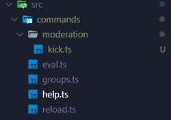
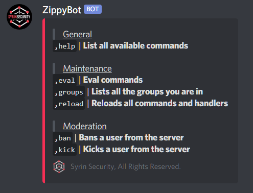

# ZippyBot

ZippyBot is a Discord bot written in Typescript.  Hot reload the whole bot including; Handlers, Commands and modules without having to restart the bot.  This can all be done by one single command, adding flexibility and potential for rapid development.

## How it's made

We are using Typescript in strict mode and Discord.js.  We have opted for a dynamic structure, this allows practically any part of the bot to be reloaded dynamically.

## Quick start guide

```bash
git clone https://github.com/syrinsecurity/zippybot.git
cd zippybot
npm install
```

> Make sure to edit the config.

```bash
cat ./src/config/config.example.ts
export const token: string = "";
export const prefix: string = ",";

export const masters: string[] = [
	"<USER ID>"
];

export const theme = {
	icon: 	"<URL TO IMAGE>",
	colour: "#C5A8BC",
	footer: "Bot",
};

export const roleBasedAuth: boolean = false;
```

> Rename and edit the config file.

```bash
mv ./src/config/config.example.ts ./src/config/config.ts
nano ./src/config/config.ts
```

Now time to run the bot!

```bash
npm start
```

## How auth works

There are two methods of auth; Role based auth or permission based auth.  Role based auth uses role IDs to assign specific groups i.e. Mod or Admin.  Permission based auth checks if a user has a specific permission i.e. the group 'Mod' must have the permission 'BAN_MEMBERS' whilst the group 'Admin' must have the permission 'ADMINISTRATOR'.  Auth of a command is handled within the ./handlers/message.ts file and ./modules/auth.ts meaning there is no need to write checks within the command files as its already handled via a class property 'authorisation' (type string[]).

| Group 	| Context 		|
|:--------------|:----------------------|
| User		| DM channel (only)	|
| Member	| Guild channel (only)	|
| Mod		| Guild channel (only)	|
| Admin		| Guild channel (only)	|
| Root		| Anywhere		|

> A key thing to remember is that groups are scoped to specific contexts as listed above.
> The group 'Root' is also known as a master, as shown in the config file.

Features:

- Hot reload
- Dynamic command loading
- Dynamic handler loading
- Dynamic module loading
- Command sub folders
- Mysql Database
- Logging
- Nuke command (completely erase and rebuild a channel)
- Webhook nuke protection (moves any webhooks out of the channel being nuked then into the new channel)

## Commands

Moderation:
- Kick
- Ban
- UnBan
- Say
- Purge
- Nuke

General:
- Help

Maintinance/Development:
- Reload
- Groups
- Eval

## Development

| Image				| 					|
|:------------------------------|:--------------------------------------|
|  | Sub folders can be used in the commands folder to organise categories of commands.  This helps a lot with organisation and cleanliness. |
|  | Dynamic help command.  The help command builds it self, commands are automatically organised based on their categories.|

The help command only shows relevant commands to the user i.e. if they are not a admin they do not need to see admin commands. 

## License

YOU CAN NOT USE THIS MATERIAL FOR COMMERCIAL USE! YOU CAN NOT USE THIS
MATERIAL IN A COMMERCIAL/FOR PROFIT ORGANISATION! THIS MATERIAL CAN ONLY
BE USED IN A NON-PROFIT ORGANISATION OR FOR PERSONAL USE. DERIVATIVES MUST NOT
BE DISTRIBUTED. ANY AND ALL USES OF THIS MATERIAL OUTSIDE THE CONTEXT OF
PERSONAL USE MUST PURCHASE A LICENSE FROM THE COPYRIGHT OWNER. YOU AGREE
NOT TO USE THIS MATERIAL IN A FOR-PROFIT BUSINESS, YOU AGREE TO NOT DISTRIBUTE
DERIVATIVES, YOU AGREE TO NOT USE THIS MATERIAL FOR COMMERCIAL USE, YOU AGREE
TO PURCHASE A LICENSE IF YOU INTEND TO USE THIS MATERIAL IN A RESTRICTED SETTING
(AS PREVIOUSLY MENTIONED). SYRINSECURITY AND IT'S BOARD RETAINS FULL EXCLUSIVE
INTELLECTUAL PROPERTY RIGHTS. WE RETAIN THE RIGHT TO MODIFY THE LICENSE AT ANY
TIME, FOR ANY REASON. WE RETAIN THE RIGHT TO DENY YOU USE OF OUR MATERIAL FOR
ANY REASON EVEN IF YOU ARE USING THE MATERIAL FOR PERSONAL USE ONLY. WE RETAIN
THE RIGHT TO MODIFY, UPDATE, DELETE AND PUBLISH OUR MATERIAL HOW WE SEE FIT.
THIS IS A NON EXCLUSIVE NON TRANSFERABLE LICENSE WITH NO WARRANTY.

License queries: legal@syrinsecurity.net
